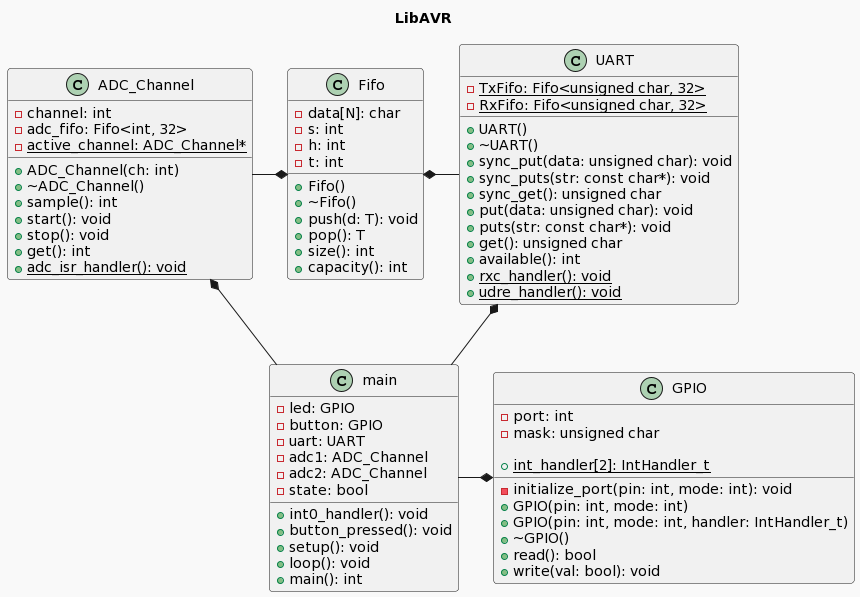

# IFSC - Sistemas Embarcados - LibAVR

Nesta atividade construiremos uma biblioteca de funções de baixo-nível para uso na CPU AVR e na Placa Arduino. Usaremos as ferramentas do GCC e construiremos o sofware em C++.

Para construir a biblioteca os alunos devem seguir as orientações do professor, a serem registradas através do sistema acadêmico.

## Ao final, a biblioteca deverá incluir

* Uma HAL para os seguintes componentes de hardware: GPIO, UART, ADC, Timer, SPI;
* Um serviço de fila de funções para escanolamento de tarefas;
* Utilitários de Fifo e Lista lineares;
* Utilitário de gerenciamento de tempo (delay, etc).

## Para gerar binários e programar a MCU

A biblioteca inclui um Makefile com as regras para geração do binário e programação do dispositivo. Algumas variáveis podem ser configuradas:

* APP := main.cpp => este é o programa principal, que será compilado, e deverá incluir a função main.
* COMPONENTS := gpio.o => esta é a lista de componentes a serem gerados. O arquivo objeto gpio.o do componente GPIO será gerado a partir do código-fonte em gpio.cpp. Ao incluir novos componentes (ex.: uart.cpp, adc.cpp), você deve atualizar esta lista para que o Makefile gere os componentes (ex.: COMPONENTS := gpio_pin.o uart.o adc.o).
* SERIAL_PORT := /dev/ttyACM0 => este é a porta serial á qual seu Arduino está conectado. Para verificar a porta correta, use o comando "ls /dev/tty*".
* CC_FLAGS => esta variável inclui as flags a serem passadas ao compilador. No Makefile há uma versão comentada desta variável que habilita o uso de floats no sprintf.

Para gerar o binário e programar o Arduino: make all

Para limpar o ambiente, excluindo os binários gerados: make clean

## Diagrama UML

## FIFO
A FIFO foi implementada para ser usada na UART e no ADC. Ela é uma estrutura de dados cuja função principal é garantir que os dados armazenados sejam processados na ordem em que foram recebidos (first in first out).

## UART
A UART permite a comunicação serial de dados entre um microcontrolador e outro dispositivo, como sensores e módulos, permitindo tanto o envio quanto a recepção de dados. Ela utiliza uma FIFO de transmissão e outra de recepção para armazenar os dados temporariamente antes de sua transmissão/processamento. A taxa de baud utilizada nesta UART é de 9600 bps.

## GPIO
O GPIO permite a leitura e escrita nos pinos de entrada e saída digital do microcontrolador. Ele possui funções para configurar o pino como entrada ou saída e para escrever ou ler o valor do pino.

## ADC
O ADC serve para realizar a conversão de um sinal analógico em um sinal digital em múltiplos canais. Ele utilza uma FIFO para armazenar os dados que são convertidos e trabalha fazendo uma conversão por vez. Ele faz a conversão medindo a tensão em um pino de entrada analógica e transforma o valor em um número de 10 bits (0 a 1023).
